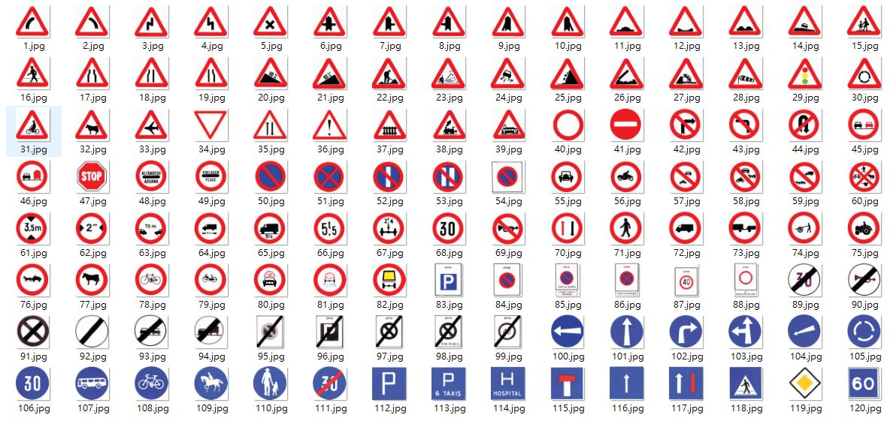

# louhau-traffic-signs

## 來源
澳門勞工子弟中學於2019年7月-8月參加了由澳大大學舉辦的[澳門人工智能挑戰賽](http://conferences.cis.umac.mo/aichallenge/)，並在期間收集了大量澳門的交通標誌。

## 分類
120種的交通標誌分類參考了[澳門交通事務局](https://www.dsat.gov.mo/dsat/subpage.aspx?a_id=1443513216)，使用了[駕駛理論文檔P34-35](https://www.dsat.gov.mo/pdf/driving_test6/C_Fascicule1_TrafficSigns.pdf)所出現的帶有數字的120種標誌。

因為歷史的原因，部分路標外觀**有所改動**，或在現時的澳門已相當罕見，具體可參考交通事務局的[交通標誌指引](https://www.dsat.gov.mo/pdf/TrafficSignalHandBook_tc.pdf)。

## 數據
比賽期間，10名學生一共收集了999張交通標誌，其分佈見下圖。
圖像的最大寬度(width)為999，最大高度(height)為999，其中  
|寬度和長度的最大值|數量|
|----------------|----|
|<=25px          |999張|
|>25px且>=50p    |999張|
|>50px且<=75px   |999張|
|>75px且<=100px  |999張|
|>100px且<=150px |999張|
|>150px          |999張|

## License
歡迎使用我們提供的交通標誌數據，使用時請列明數據的出處。

## 貢獻者
作出貢獻的學生包括：  
高二甲班 梁佩雯、盧威兆、陳智煒、林志強、伍志發

